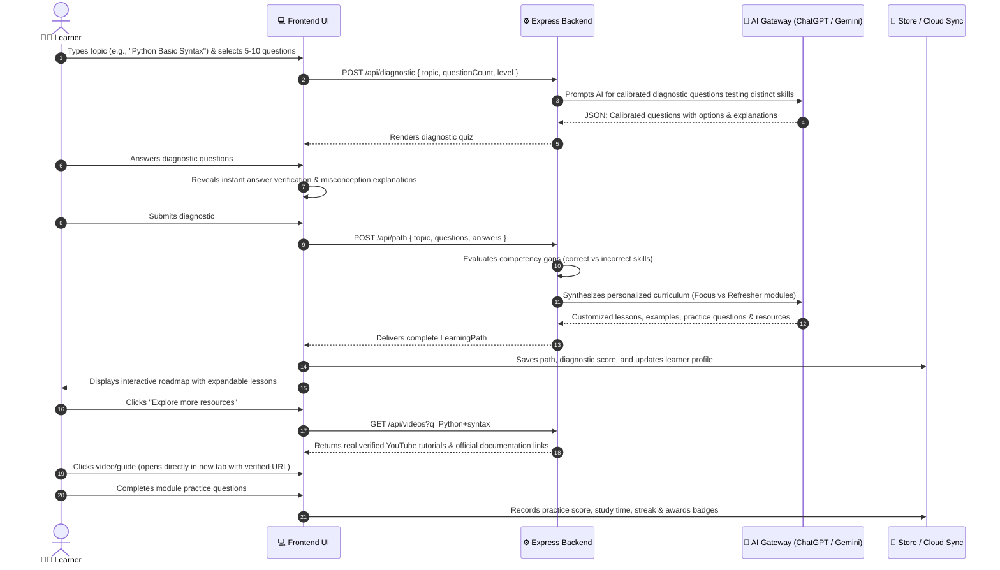

<div align="center">

# 🧭 Path-Finder (LearnPath AI)
### *Start with a question. End with understanding.*

An adaptive, AI-orchestrated learning engine that diagnoses student knowledge gaps through 5–10 calibrated questions, synthesizes personalized multi-module learning paths with verified video tutorials & authoritative resources, and provides interactive practice with continuous mastery tracking.

---

[](https://react.dev/)
[](https://www.typescriptlang.org/)
[](https://vite.dev/)
[](https://tailwindcss.com/)
[](https://expressjs.com/)
[](https://ai.google.dev/)
[](https://openai.com/)
[](https://firebase.google.com/)

[Key Features](#-core-features) • [System Architecture](#️-system-architecture) • [User Flow](#-user-journey--pedagogical-flow) • [Quick Start](#-getting-started) • [API Docs](#-api-reference)

---

</div>

## 🎯 The Challenge & Vision

Traditional learning platforms treat students like identical factory parts: everyone gets the same 40-hour video playlist or static textbook chapter, regardless of what they already understand.

**Path-Finder** transforms learning into an intelligent, adaptive conversation:

1. **Unconstrained Subject Input**: Enter *any* topic—from foundational subjects like *Python Syntax* or *Linear Algebra* to cutting-edge domains like *Quantum Computing*, *React 19 Server Components*, or *Organic Chemistry*.
2. **Diagnostic Assessment (5–10 Questions)**: Diagnoses specific sub-competencies, isolating exact points of confusion without grade-pressure.
3. **Adaptive Path Synthesis**:
   - **Targeted Focus Modules**: Deep-dive lessons (10–14 min) with intuitive conceptual breakdowns, worked code examples, and practice for missed concepts.
   - **Refresher Modules**: Accelerated overviews (6–8 min) for mastered skills with advanced application challenges.
4. **Verified Multi-Media Resources**: Verified YouTube tutorials from top educational creators (freeCodeCamp, Corey Schafer, Programming with Mosh, 3Blue1Brown, CS50) and authoritative documentation (Python Docs, MDN, Khan Academy).
5. **Formative Practice & Competency Matrix**: In-module practice exercises with instant feedback, streak tracking, daily goal rings, and a persistent **Skill Mastery Matrix**.

---

## 🏗️ System Architecture

Path-Finder is architected with a resilient client-server topology featuring an **AI Gateway with Multi-Provider Cascading Fallback** to guarantee 100% zero-downtime pedagogy.

```mermaid
flowchart TD
    subgraph Client ["Frontend (React 19 + TypeScript + Vite)"]
        UI["Landing & Topic Prompt Bar"]
        Diag["Diagnostic Assessment (5-10 Qs)"]
        PathView["Personalized Learning Path (Modules & Drawer)"]
        Prac["Module-by-Module Practice Engine"]
        Prog["Progress Dashboard & Skill Mastery Matrix"]
        Store["StoreProvider (LocalStorage + Firebase Sync)"]
        
        UI --> Diag --> PathView --> Prac --> Prog
        Store -.->|State & Profile| Client
    end

    subgraph Backend ["Backend API (Node.js + Express 5)"]
        API["Express Router (/api)"]
        DiagRoute["POST /api/diagnostic"]
        PathRoute["POST /api/path"]
        VideoRoute["GET /api/videos"]
        StatusRoute["GET /api/status"]
        
        API --> DiagRoute
        API --> PathRoute
        API --> VideoRoute
        API --> StatusRoute
    end

    subgraph AIGateway ["Unified AI Gateway (server/services/llm.ts)"]
        Router{"AI Router"}
        ChatGPT["ChatGPT / Experiential Labs\n(gpt-4o-mini / gpt-4o)"]
        Gemini["Google Gemini Generative AI\n(gemini-3.5-flash-lite)"]
        Pedagogy["Deterministic Pedagogical Engine\n(Zero-Downtime Fallback)"]
        
        DiagRoute --> Router
        PathRoute --> Router
        Router -->|"Tier 1: Intensive Reasoning"| ChatGPT
        ChatGPT -.->|"Tier 2: Automatic Fallback"| Gemini
        Gemini -.->|"Tier 3: Graceful Offline Fallback"| Pedagogy
    end

    subgraph External ["External Services & Curated Media"]
        YouTube["Verified YouTube Educational Video Catalog"]
        Docs["Authoritative Documentation\n(Python Docs, MDN, OpenStax, Khan Academy)"]
        Firebase["Firebase Auth & Cloud Firestore Sync"]
    end

    Client -->|REST Proxy /api| Backend
    VideoRoute --> YouTube
    VideoRoute --> Docs
    Store -.->|Google Auth & Cloud Sync| Firebase
```

---

## 🔄 User Journey & Pedagogical Flow



---

## ✨ Core Features

| Feature | Description |
| :--- | :--- |
| **Dynamic Topic Input** | Type *any* custom subject directly on the Landing Hero or Diagnostic page. Not restricted to pre-made templates. |
| **5–10 Question Calibrator** | Flexible assessment length (5, 7, or 10 questions) and difficulty levels (Beginner, Intermediate, Advanced). |
| **Instant Diagnostic Insights** | Immediate educational feedback explaining *why* the correct answer works and detailing misconceptions behind distractors. |
| **Adaptive Learning Modules** | Automatically tags each lesson as **Targeted Focus** (for missed skills with detailed guides) or **Refresher** (for mastered skills with advanced challenges). |
| **Real YouTube Videos & Docs** | Embedded resource drawer providing verified YouTube tutorials from top creators (freeCodeCamp, Corey Schafer, 3Blue1Brown, CS50) and official documentation (Python Docs, MDN, Khan Academy). |
| **Guaranteed Link Reliability** | Built-in link sanitizer and direct `window.open` handlers ensuring every video and resource link opens external pages reliably. |
| **Interactive Practice Engine** | Module-by-module exercises with instant evaluation, feedback, and score retention. |
| **Skill Competency Matrix** | Live mastery dashboard categorizing all assessed competencies across your learning sessions as *Mastered* vs *Needs Practice*. |
| **Google Firebase SSO & Cloud Sync** | Seamless Google Sign-In displaying user avatar, name, and email reactively across topbar and sidebar, with local-first offline support. |

---

## 🛠️ Technology Stack

### Frontend
- **Framework**: [React 19](https://react.dev/) + [TypeScript](https://www.typescriptlang.org/)
- **Bundler & Tooling**: [Vite 7](https://vite.dev/) with hot module replacement (HMR)
- **Styling**: [Tailwind CSS 4](https://tailwindcss.com/) + custom LearnPath design system
- **Icons**: [Lucide React](https://lucide.dev/) (modern, accessible SVG iconography)
- **Routing**: [React Router DOM 7](https://reactrouter.com/) (declarative client routing)
- **Authentication**: [Firebase Web SDK 12](https://firebase.google.com/) (Google OAuth & persistence)

### Backend
- **Server**: [Node.js](https://nodejs.org/) (v18+) & [Express 5](https://expressjs.com/)
- **Runtime**: [tsx](https://github.com/privatenumber/tsx) with watch mode for rapid iteration
- **Security & Utilities**: CORS, dotenv, robust error-handling middleware

### AI & Pedagogical Engine
- **ChatGPT / Experiential Labs Gateway**: Primary model gateway utilizing `gpt-4o-mini`, `gpt-4o`, and `gpt-5.6-luna`.
- **Google Gemini Generative AI**: Active generative model utilizing `gemini-3.5-flash-lite` and `gemini-3.5-flash`.
- **Pedagogical Generator**: Deterministic curriculum generator ensuring uninterrupted uptime even when offline.

---

## 🚀 Getting Started

### Prerequisites
- **Node.js** v18.0.0 or higher
- **npm** or **pnpm**

### 1. Clone the Repository
```bash
git clone https://github.com/Sam-bot-dev/Path-Finder.git
cd Path-Finder
npm install
```

### 2. Configure Environment Variables
Copy `.env.example` to `.env`:
```bash
cp .env.example .env
```

Configure your credentials in `.env`:
```env
# Google Gemini Generative AI
GEMINI_API_KEY=your_gemini_api_key_here
GEMINI_MODEL=gemini-3.5-flash-lite

# ChatGPT / Experiential Labs Gateway
EXPERIENTIAL_API_KEY=your_openai_or_xpl_key_here
OPENAI_API_KEY=your_openai_or_xpl_key_here
EXPERIENTIAL_BASE_URL=https://api.experientiallabs.ai/v1

# Firebase Authentication (Google SSO)
VITE_FIREBASE_API_KEY=your_firebase_api_key
VITE_FIREBASE_AUTH_DOMAIN=your_project.firebaseapp.com
VITE_FIREBASE_PROJECT_ID=your_project_id
VITE_FIREBASE_APP_ID=your_firebase_app_id

# Server Port
PORT=3001
```

### 3. Run the Development Server
Launch both the Express backend and the Vite client simultaneously:
```bash
npm run dev
```

- **Frontend Application**: [http://localhost:5173](http://localhost:5173) (or `http://localhost:5174`)
- **Backend API Server**: [http://localhost:3001](http://localhost:3001)

### 4. Build for Production
```bash
npm run build
```

---

## 📡 API Reference

### `GET /api/status`
Checks server health and active AI providers.
```json
{
  "status": "ok",
  "ai": true,
  "provider": "chatgpt",
  "model": "gpt-4o-mini",
  "providers": { "chatgpt": true, "gemini": true }
}
```

### `POST /api/diagnostic`
Generates 5–10 diagnostic questions for any topic.
```json
// Request
{
  "topic": "Python Syntax and Control Flow",
  "questionCount": 5,
  "level": "Beginner"
}

// Response
{
  "questions": [
    {
      "id": "q1",
      "skill": "Variables and Data Types",
      "prompt": "What data type is produced by 3.5 in Python?",
      "options": ["int", "str", "float", "bool"],
      "answer": 2,
      "explanation": "A float represents real numbers with a fractional component."
    }
  ]
}
```

### `POST /api/path`
Generates a personalized learning path based on student diagnostic performance.
```json
// Request
{
  "topic": "Python Syntax and Control Flow",
  "questions": [ ... ],
  "answers": [ 2, 1, 0, 3, 2 ]
}

// Response
{
  "id": "uuid",
  "topicName": "Python Syntax and Control Flow",
  "modules": [
    {
      "id": "m-1",
      "title": "Refresher: Variables and Data Types",
      "description": "Quick review of basic memory allocation and types.",
      "minutes": 7,
      "focus": false,
      "content": [ "..." ],
      "example": { "title": "Example", "text": "..." },
      "practice": [ ... ],
      "resourceUrl": "https://docs.python.org/3/tutorial/",
      "resourceLabel": "Official Python 3 Documentation"
    }
  ]
}
```

### `GET /api/videos?q={query}`
Returns verified YouTube educational videos, direct search queries, and curated documentation links.
```json
// Response
{
  "videos": [
    {
      "id": "rfscVS0vtbw",
      "title": "Python for Beginners - Full Course [4 Hours]",
      "channel": "freeCodeCamp.org",
      "thumbnail": "https://i.ytimg.com/vi/rfscVS0vtbw/hqdefault.jpg",
      "url": "https://youtube.com/watch?v=rfscVS0vtbw"
    }
  ],
  "resources": [
    {
      "title": "Python.org Official Tutorial",
      "url": "https://docs.python.org/3/tutorial/",
      "source": "Python Software Foundation",
      "description": "Authoritative guide covering language fundamentals.",
      "type": "docs"
    }
  ],
  "youtubeSearchUrl": "https://www.youtube.com/results?search_query=python%20tutorial%20educational"
}
```

---

## 📂 Project Structure

```
Path-Finder/
├── server/                         # Express API & AI Gateway
│   ├── index.ts                    # Server initialization and routes
│   └── services/
│       ├── gemini.ts               # Google Gemini integration
│       ├── llm.ts                  # Multi-provider routing (ChatGPT + Gemini)
│       ├── pedagogy.ts             # Deterministic fallback pedagogy engine
│       └── resourceService.ts      # Verified YouTube and web resource catalog
├── src/                            # React 19 Frontend
│   ├── components/
│   │   ├── Shell.tsx               # App layout with reactive user profile
│   │   ├── AccountModal.tsx        # Profile & Google Sign-In modal
│   │   ├── TopicBrowser.tsx        # Search & instant check-in generator
│   │   └── ui.tsx                  # Buttons, badges, and progress rings
│   ├── data/                       # Foundational curated subjects
│   ├── lib/
│   │   ├── firebase.ts             # Firebase Auth & Cloud Firestore sync
│   │   ├── services.ts             # API client with fallback handling
│   │   ├── store.tsx               # Reactive store with instant auth updates
│   │   └── types.ts                # Application data contracts
│   └── pages/
│       ├── Landing.tsx             # Interactive landing page with topic input
│       ├── DiagnosticPage.tsx      # Diagnostic setup (slider & difficulty)
│       ├── Diagnostic.tsx          # Dynamic 5-10 question assessment
│       ├── Results.tsx             # Competency summary & path generation
│       ├── LearningPath.tsx        # Adaptive modules & resource drawer
│       ├── Practice.tsx            # Formative practice session
│       ├── Progress.tsx            # Skill Competency Matrix & analytics
│       └── Settings.tsx            # Preferences, backup & cloud accounts
├── .env.example                    # Environment variable template
├── package.json                    # Scripts and dependencies
├── vite.config.ts                  # Vite configuration with /api proxy
└── README.md                       # Comprehensive documentation
```

---

## 📄 License

This project is licensed under the **MIT License**. Crafted with precision for curious minds everywhere.
