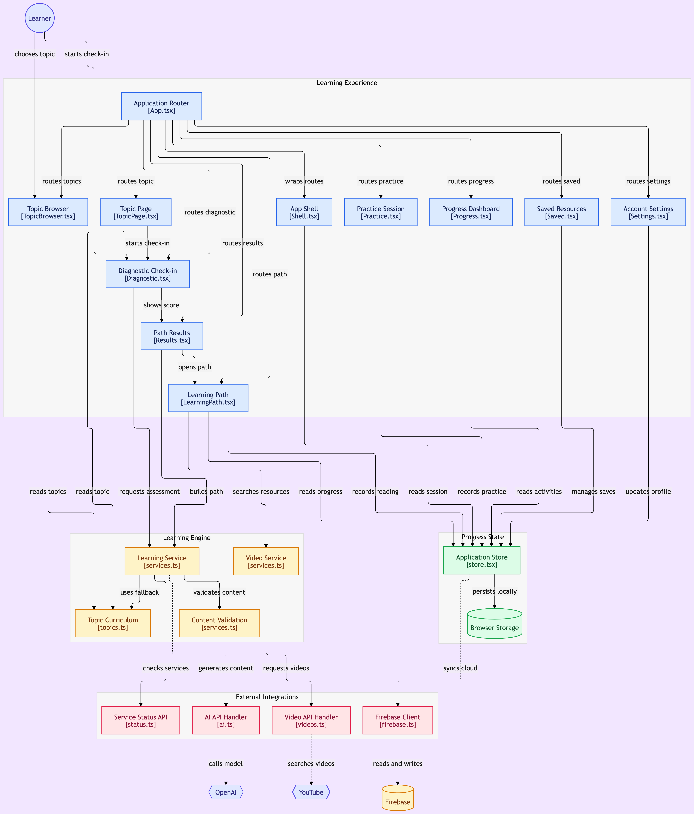
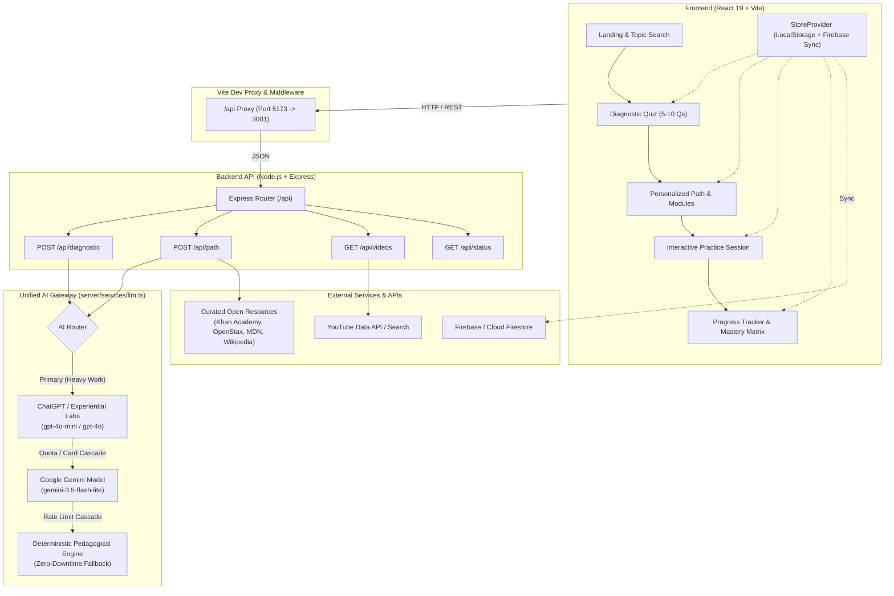
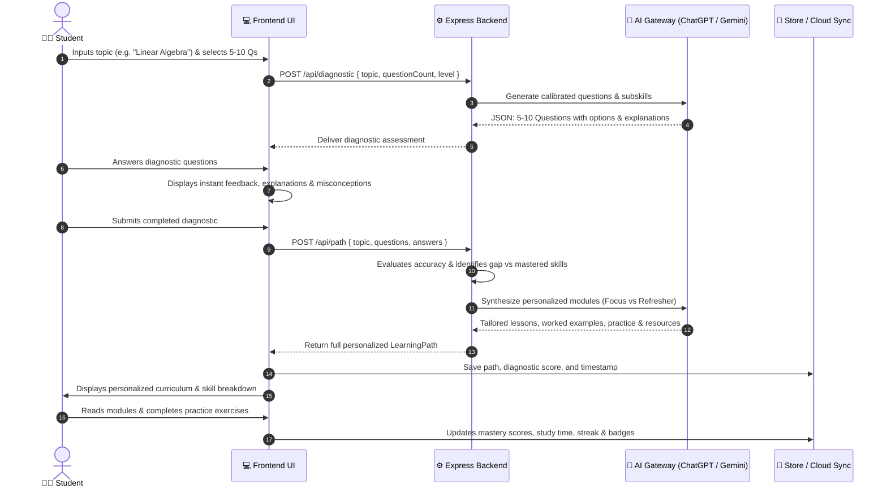

# 🧭 Path-Finder (LearnPath AI)

> **"Start with a question. End with understanding."**  
> An adaptive, AI-orchestrated learning tool that diagnoses student knowledge gaps, synthesizes personalized multi-module learning paths with rich resources and practice exercises, and provides a continuous progress tracker.

---

[](https://react.dev/)
[](https://www.typescriptlang.org/)
[](https://vite.dev/)
[](https://tailwindcss.com/)
[](https://expressjs.com/)
[](https://ai.google.dev/)
[](https://openai.com/)

---

## 🎯 The Challenge & Mission

> **Challenge**: Create a tool where a student answers **5–10 diagnostic questions** on a topic, and the system generates a **personalized learning path** with **recommended resources**, **practice exercises**, and a **progress tracker**.

Most online learning platforms are static—they present the same linear curriculum to everyone regardless of prior knowledge. **Path-Finder** solves this through intelligent pedagogical diagnosis:

1. **Any Topic Input**: Students are not restricted to predefined catalogs. Enter *any* subject—from *Quantum Computing* to *Organic Chemistry*, *React Architecture*, or *French Grammar*.
2. **Adaptive Diagnostic Assessment**: Answers **5 to 10 calibrated questions** that test specific competencies from foundational to advanced.
3. **Personalized Curriculum Generation**:
   - **Targeted Focus Areas**: For skills answered incorrectly, generates deep-dive lessons (10–14 min), intuitive analogies, step-by-step worked examples, and targeted practice.
   - **Refresher Modules**: For mastered skills, provides accelerated overviews (6–8 min) and advanced application challenges.
4. **Verified Resources & Video Search**: Curated links to authoritative references (Wikipedia, MDN, OpenStax, Khan Academy) and automated educational video queries.
5. **Interactive Practice & Mastery Tracking**: Formative practice questions per module with instant feedback and a persistent **Skill Competency Matrix**.

---

## 🏗️ System Architecture

Path-Finder is built with a resilient client-server architecture featuring an **AI Gateway with Cascading Fallback** to guarantee uninterrupted learning.



### Architectural Diagram (Mermaid)



---

## 🔄 User Journey & Data Flow



---

## ✨ Core Features

| Feature | Description |
| :--- | :--- |
| **Dynamic Topic Input** | Type *any* custom subject on the Landing Hero or Diagnostic page. Not restricted to hardcoded topics. |
| **5–10 Adaptive Questions** | Choose assessment length (5, 6, 7, 8, or 10 questions) and target difficulty (Beginner, Intermediate, Advanced). |
| **Instant Explanations** | Educational feedback reveals why the right answer is correct and explains the misconception behind distractors. |
| **Adaptive Lesson Modules** | Modules adapt to performance: **Targeted Focus** for incorrect skills (10–14 min, step-by-step breakdown) vs **Refresher** for correct skills. |
| **Curated Multi-Media Resources** | Integrated documentation links (Wikipedia, MDN, OpenStax, Khan Academy) and YouTube video searches. |
| **Module Practice & Grading** | Dedicated interactive practice questions for each module with instant verification and score recording. |
| **Comprehensive Progress Tracker** | Live dashboard tracking: active paths, completion %, hours spent, daily streak, daily goal ring, and achievement badges. |
| **Skill Competency Matrix** | Real-time breakdown categorizing every assessed skill across all sessions as *Mastered* vs *Needs Practice*. |
| **Hybrid Cloud / Local Sync** | Local-first architecture stored in `localStorage` with seamless optional Firebase Auth & Firestore cloud sync. |

---

## 🛠️ Technology Stack

- **Frontend**:
  - React 19 + TypeScript
  - Vite 7 with Fast HMR & Tailwind CSS 4
  - Framer Motion for smooth transitions
  - Lucide React for consistent iconography
  - React Router DOM 7 for single-page routing
- **Backend**:
  - Node.js (v18+) & Express 4
  - TypeScript executed seamlessly with `tsx`
  - CORS & Dotenv configuration
- **AI & Pedagogical Engine**:
  - **ChatGPT / Experiential Labs**: Primary model gateway (`gpt-4o-mini`, `gpt-4o`, `gpt-5.6-luna`)
  - **Google Gemini**: Active generative engine (`gemini-3.5-flash-lite`, `gemini-3.5-flash`, `gemini-2.5-pro`)
  - **Pedagogical Engine**: Built-in deterministic generator ensuring 100% uptime
- **Storage & Cloud**:
  - Browser `localStorage` (offline & local-first)
  - Firebase Authentication & Firestore (optional cloud sync)

---

## 🚀 Quick Start Guide

### Prerequisites
- **Node.js** v18.0.0 or higher
- **npm** or **pnpm**

### 1. Clone & Install

```bash
git clone https://github.com/Sam-bot-dev/Path-Finder.git
cd Path-Finder
npm install
```

### 2. Configure Environment Variables

Create a `.env` file in the root directory (or copy from `.env.example`):

```bash
cp .env.example .env
```

Edit `.env` with your API credentials:

```env
# Google Gemini AI Configuration
GEMINI_API_KEY=your_gemini_api_key_here
GEMINI_MODEL=gemini-3.5-flash-lite

# ChatGPT / Experiential Labs Gateway
EXPERIENTIAL_API_KEY=your_xpl_or_openai_api_key_here
OPENAI_API_KEY=your_xpl_or_openai_api_key_here
EXPERIENTIAL_BASE_URL=https://api.experientiallabs.ai/v1

# Optional YouTube Data API
YOUTUBE_API_KEY=

# Server Configuration
PORT=3001
VITE_API_BASE_URL=
```

### 3. Run Development Server

Start both the backend server and frontend simultaneously with a single command:

```bash
npm run dev
```

- **Frontend**: `http://localhost:5173` (or `http://localhost:5174`)
- **Backend API**: `http://localhost:3001`
- Requests to `/api/*` on the frontend are automatically proxied to the Express backend.

### 4. Build for Production

```bash
npm run build
```

---

## 📡 API Reference

### `GET /api/status`
Returns backend health and active AI providers.
```json
{
  "status": "ok",
  "ai": true,
  "provider": "chatgpt",
  "model": "gpt-4o-mini",
  "providers": { "chatgpt": true, "gemini": true }
}
```

### `POST /api/diagnostic`
Generates 5–10 diagnostic questions for any topic.
```json
// Request Body
{
  "topic": "Quantum Computing",
  "questionCount": 5,
  "level": "Intermediate"
}
```

### `POST /api/path`
Generates a personalized learning path based on student diagnostic performance.
```json
// Request Body
{
  "topic": "Quantum Computing",
  "questions": [ ... ],
  "answers": [ 1, 2, 0, 1, 2 ]
}
```

### `GET /api/videos?q={query}`
Searches educational YouTube videos for a specific lesson or subskill.

---

## 📂 Repository Structure

```
Path-Finder/
├── api/                   # Vercel serverless function adapters
│   ├── diagnostic.ts      # Serverless diagnostic endpoint
│   ├── path.ts            # Serverless path generator
│   └── status.ts          # Serverless status checker
├── assets/                # Visual diagrams and UI screenshots
│   └── diagram.png        # Complete architecture diagram
├── server/                # Standalone Express backend
│   ├── index.ts           # Express server & API routes
│   └── services/
│       ├── gemini.ts      # Google Gemini integration
│       ├── llm.ts         # Multi-provider AI Gateway (ChatGPT + Gemini)
│       ├── pedagogy.ts    # Deterministic pedagogical generator
│       └── resourceService.ts # Verified resource & video search
├── src/                   # React 19 Frontend
│   ├── components/        # Shell, TopicBrowser, UI controls
│   ├── data/              # Curated foundational tracks
│   ├── lib/               # Services, store, types & Firebase
│   └── pages/             # Landing, Diagnostic, LearningPath, Practice, Progress
├── .env.example           # Environment template
├── package.json           # Dependencies & concurrent dev scripts
├── vite.config.ts         # Vite build configuration with /api proxy
└── README.md              # Project documentation & architecture
```

---

## 📄 License

MIT License. Designed with care for curious minds.
